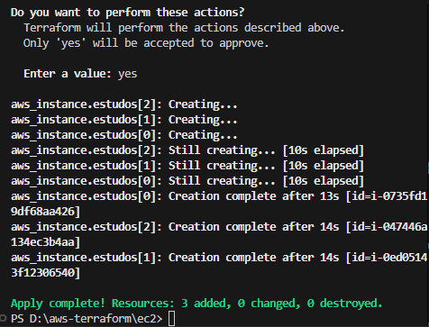
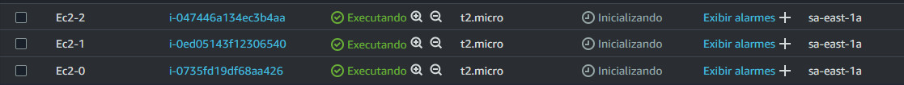

# AWS Terraform EC2 Setup


## Descrição
Este repositório contém um exemplo prático de como criar um ambiente na AWS com instâncias EC2 utilizando o Terraform. O projeto demonstra como configurar e provisionar infraestrutura na AWS de forma automatizada, com foco em boas práticas de DevOps e infraestrutura como código.

## Objetivo
O objetivo deste projeto é criar um ambiente com **três instâncias EC2** (Elastic Compute Cloud) utilizando o Terraform. Nosso foco será a utilização do **Terraform** para provisionar a infraestrutura, então não abordaremos em detalhes a criação de uma conta AWS ou a configuração de chaves de acesso.

## 🤝 Colaborador

<table>
  <tr>
    <td align="center">
      <a href="#" title="Lenda">
        <br>
        <sub>
          <b>Lucas C Alecrim</b>
        </sub>
      </a>
    </td>
</table>


## 💻 Pré-requisitos

Antes de começar, você precisará de:

1. Uma **conta AWS** ativa.
2. **AWS CLI** instalado e configurado para permitir o acesso ao console AWS a partir do seu ambiente local.
3. **Terraform** instalado no seu ambiente local.

### Instalação do AWS CLI

Siga as instruções para instalar e configurar o AWS CLI no seu sistema operacional:
- [Guia de instalação do AWS CLI](https://docs.aws.amazon.com/cli/latest/userguide/install-cliv2.html)

### Instalação do Terraform

Você pode instalar o Terraform seguindo as instruções disponíveis no site oficial:
- [Guia de instalação do Terraform](https://developer.hashicorp.com/terraform/downloads)

## Configuração do Ambiente

**Configuração do AWS CLI**: Após instalar o AWS CLI, configure-o para acessar sua conta AWS:
   ```bash
   aws configure
```
- Inicializar o Terraform: Este comando inicializa o diretório do Terraform e baixa os plugins necessários.

# Opções relacionadas ao SSH 

- Utilizei uma chave publica para iniciar o projet, caso tenha alguma de como criar Segue um passo a passo Basico - [Guia de instalação do SSH](https://www.digitalocean.com/community/tutorials/how-to-set-up-ssh-keys-on-ubuntu-20-04-pt)
meu conselho é ter um WSL pois no ubuntu é bem mais simples configurar, depois de configurar uma SSH publica ou privada basta apenas exportar para o par de chaves na AWS


- depois é so confirar no main.tf qual o ssh que vai ser usado
```ts
resource "aws_instance" "estudos" {
  count = 3
  ami = "ami-0c5410a9e09852edd" 
  
  // qual o Sistema operaciona, nesse caso foi o ubuntu

  instance_type = "t2.micro"
  key_name = "UbuntuWSL-pub" // aqui

  tags = {
    Name = "Ec2-${count.index}" // nome + contador para melhorar a identificação
  }
}
```

# Iniciando o terraform
### **Seria dentro da pasta onde esta o Main.ts**
- Nesse caso **aws-terraform\ec2**
 ```bash
terraform init
 ```
- Verificar o plano de execução: Antes de aplicar as mudanças, você pode verificar o que será criado, modificado ou destruído.

 ```bash
terraform plan
 ```
- Aplicar a configuração: Para criar as instâncias EC2 conforme definido no arquivo main.tf

 ```bash
terraform apply
 ```
- Você será solicitado a confirmar a execução. Digite "yes" para prosseguir.

 



## Limpeza do Ambiente
Após concluir seus testes ou experimentos, é importante destruir a infraestrutura criada para evitar cobranças desnecessárias na sua conta AWS. Para isso, execute:

```bash
terraform destroy
```
- Você também será solicitado a confirmar a ação. Digite "yes" para prosseguir.


## 📝 Licença

Esse projeto está licenciado sob a Licença MIT!
Veja o arquivo [LICENSE](LICENSE) para mais detalhes.

