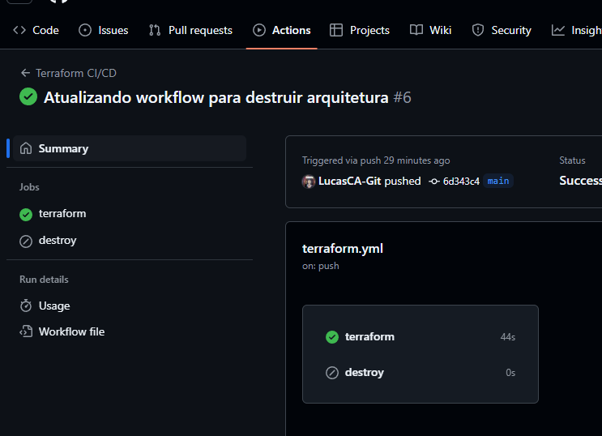

# AWS Terraform EC2 Setup


# Descrição
Este repositório contém um exemplo prático de como criar um ambiente na AWS com instâncias EC2 utilizando o Terraform. O projeto demonstra como configurar e provisionar infraestrutura na AWS de forma automatizada, com foco em boas práticas de DevOps e infraestrutura como código.

## Objetivo
O objetivo deste projeto é criar um ambiente com **três instâncias EC2** (Elastic Compute Cloud) utilizando o Terraform. Nosso foco será a utilização do **Terraform** para provisionar a infraestrutura, então não abordaremos em detalhes a criação de uma conta AWS ou a configuração de chaves de acesso.

## CI/CD com GitHub Actions
O projeto inclui um pipeline de CI/CD configurado com GitHub Actions para automatizar a execução de comandos Terraform, facilitando a criação e destruição de recursos na AWS.

## 🤝 Colaborador

<table>
  <tr>
    <td align="center">
      <a href="#" title="Lenda">
        <br>
        <sub>
          <b>Lucas C Alecrim</b>
        </sub>
      </a>
    </td>
</table>


## 💻 Pré-requisitos

Antes de começar, você precisará de:

1. Uma **conta AWS** ativa.
2. **AWS CLI** instalado e configurado para permitir o acesso ao console AWS a partir do seu ambiente local.
3. **Terraform** instalado no seu ambiente local.

### Instalação do AWS CLI

Siga as instruções para instalar e configurar o AWS CLI no seu sistema operacional:
- [Guia de instalação do AWS CLI](https://docs.aws.amazon.com/cli/latest/userguide/install-cliv2.html)

### Instalação do Terraform

Você pode instalar o Terraform seguindo as instruções disponíveis no site oficial:
- [Guia de instalação do Terraform](https://developer.hashicorp.com/terraform/downloads)

## Configuração do Ambiente

**Configuração do AWS CLI**: Após instalar o AWS CLI, configure-o para acessar sua conta AWS:
   ```bash
   aws configure
```
- Inicializar o Terraform: Este comando inicializa o diretório do Terraform e baixa os plugins necessários.

# Opções relacionadas ao SSH 

- Utilizei uma chave publica para iniciar o projet, caso tenha alguma de como criar Segue um passo a passo Basico - [Guia de instalação do SSH](https://www.digitalocean.com/community/tutorials/how-to-set-up-ssh-keys-on-ubuntu-20-04-pt)
meu conselho é ter um WSL pois no ubuntu é bem mais simples configurar, depois de configurar uma SSH publica ou privada basta apenas exportar para o par de chaves na AWS


- depois é so confirar no main.tf qual o ssh que vai ser usado
```ts
resource "aws_instance" "estudos" {
  count = 3
  ami = "ami-0c5410a9e09852edd" 
  
  // qual o Sistema operaciona, nesse caso foi o ubuntu

  instance_type = "t2.micro"
  key_name = "UbuntuWSL-pub" // aqui

  tags = {
    Name = "Ec2-${count.index}" // nome + contador para melhorar a identificação
  }
}
```

# Iniciando o terraform
### **Seria dentro da pasta onde esta o Main.ts**
- Nesse caso **aws-terraform\ec2**
 ```bash
terraform init
 ```
- Verificar o plano de execução: Antes de aplicar as mudanças, você pode verificar o que será criado, modificado ou destruído.

 ```bash
terraform plan
 ```
- Aplicar a configuração: Para criar as instâncias EC2 conforme definido no arquivo main.tf

 ```bash
terraform apply
 ```
- Você será solicitado a confirmar a execução. Digite "yes" para prosseguir.

 


## Limpeza do Ambiente
Após concluir seus testes ou experimentos, é importante destruir a infraestrutura criada para evitar cobranças desnecessárias na sua conta AWS. Para isso, execute:

```bash
terraform destroy
```
- Você também será solicitado a confirmar a ação. Digite "yes" para prosseguir.


## CD/CI Pipeline GitActions

### Visão Geral
Neste projeto, utilizamos o GitHub Actions para implementar um fluxo de trabalho de CI/CD que automatiza o processo de criação e gerenciamento de instâncias EC2 na AWS utilizando o Terraform. Essa abordagem proporciona eficiência, consistência e segurança no gerenciamento da infraestrutura.

### Como Funciona

#### 1. Estrutura do Workflow
O workflow do GitHub Actions está configurado para ser acionado em eventos de `push` na branch principal do repositório. Isso significa que sempre que novas alterações são enviadas para a branch principal, o workflow será executado automaticamente.

#### 2. Etapas do Workflow
O fluxo de trabalho é dividido em várias etapas, cada uma com uma função específica:

- **Check out do Código:** A primeira etapa usa a ação `actions/checkout@v2` para baixar o código do repositório. Isso é necessário para que as etapas subsequentes possam acessar o código e os arquivos de configuração do Terraform.

- **Configuração do Terraform:** Utiliza-se a ação `hashicorp/setup-terraform@v1` para instalar a versão especificada do Terraform. Isso garante que o ambiente esteja preparado para executar os comandos do Terraform.

- **Inicialização do Terraform:** A etapa `terraform init` inicializa o diretório do Terraform, baixando os provedores necessários e preparando o ambiente para a execução dos comandos de configuração.

- **Planejamento do Terraform:** A etapa `terraform plan` é executada para criar um plano de execução, onde o Terraform determina quais mudanças serão aplicadas na infraestrutura. Essa etapa verifica se todas as configurações estão corretas e se as credenciais da AWS estão disponíveis.

- **Aplicação do Terraform:** Finalmente, a etapa `terraform apply -auto-approve` aplica as mudanças necessárias para criar ou atualizar a infraestrutura na AWS. A opção `-auto-approve` é utilizada para evitar a necessidade de confirmação manual, permitindo que a aplicação ocorra automaticamente.

#### 3. Credenciais Seguras
As credenciais necessárias para acessar a AWS (como `AWS_ACCESS_KEY_ID` e `AWS_SECRET_ACCESS_KEY`) são armazenadas de forma segura como *Secrets* no repositório do GitHub. Essas variáveis de ambiente são referenciadas no workflow, garantindo que as credenciais não sejam expostas no código.

### Vantagens do Uso de CI/CD com GitHub Actions no Projeto
- **Automação Total:** Cada alteração no código resulta automaticamente na criação ou atualização da infraestrutura, reduzindo o tempo de espera entre desenvolvimento e implantação.
  
- **Detecção Precoce de Erros:** Qualquer problema na configuração do Terraform ou na conectividade com a AWS é detectado rapidamente durante a execução do workflow, permitindo correções antes que o código seja implantado.

- **Rastreabilidade:** Todas as mudanças na infraestrutura são documentadas através dos commits e logs do GitHub Actions, proporcionando uma trilha de auditoria clara sobre quem fez o quê e quando.

- **Facilidade de Colaboração:** A equipe pode colaborar de forma mais eficaz, sabendo que as implantações e atualizações são gerenciadas de forma padronizada e automatizada.



- Destroi de maneira "Manual" 


## 📝 Licença

Esse projeto está licenciado sob a Licença MIT!
Veja o arquivo [LICENSE](LICENSE) para mais detalhes.

